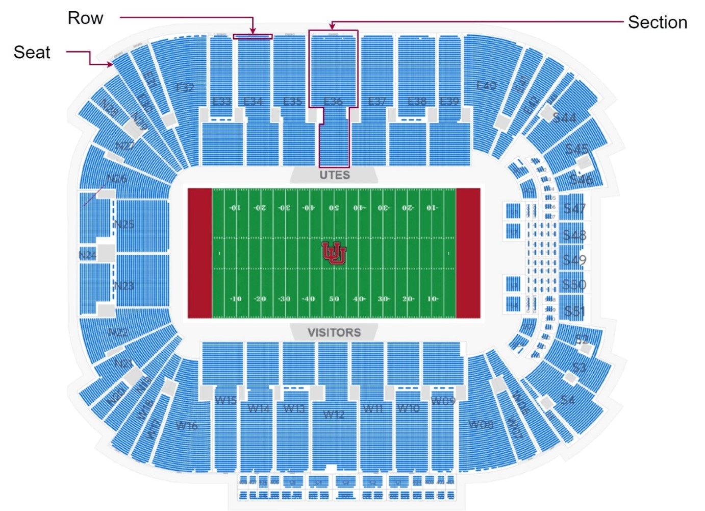
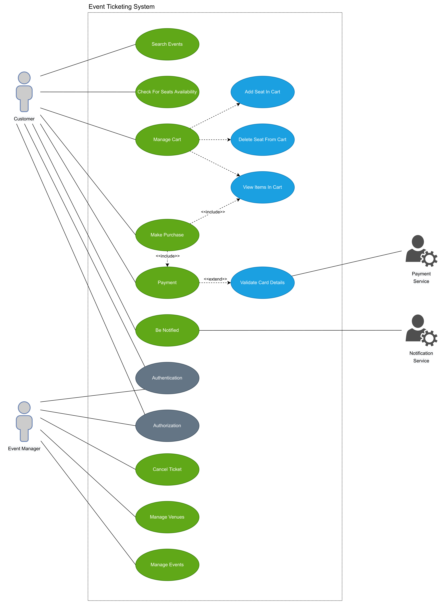
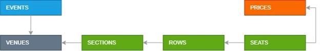

Domain Vocabulary:

**Event** – An event is an occurrence in time. In ticketing system, the event acts as a container for both venue (which holds inventory) and meta data about the event itself (name, venue, date, time).

**Venue** – the place where an event is happening.

**Manifest** – the seating arrangement applicable to a particular venue (complete seat map).

**Seat –** the smallest manifest unit that can be purchased or booked. The are two seat types - specific designated place in a row and general admission. General admission means patrons can choose to sit anywhere within a particular section (for example, the dance floor)

**Offer** – something you can buy and price for it. All seats in the ticketing system need to be sold through an offer. An offer is simply a configuration of properties that tell the system how the tickets should be sold

**Prices –** Information about the ticket price levels (Adult, Child, VIP, etc.)

**Ticket –** document (digital or printed), serving as evidence of admission price of some event. Tickets should include information about the event, the date and time of the event, venue and seats that have been paid for or booked.

**Customer –** an authenticated user who searches for tickets for an event of interest to him and buys a ticket through an online system

**Event Manager –** the user of the system who is responsible for administering the event (setting up the manifest, configuring the offer)

-   [Software Design: Modeling with UML](https://www.linkedin.com/learning/software-design-modeling-with-uml) (LinkedIn, 1h 40m)
-   [Use Case Diagram Relationships](https://creately.com/blog/diagrams/use-case-diagram-relationships/) (reading, 15m)
-   [Sequence Diagram Tutorial](https://creately.com/blog/diagrams/sequence-diagram-tutorial/) (reading, 9m) 